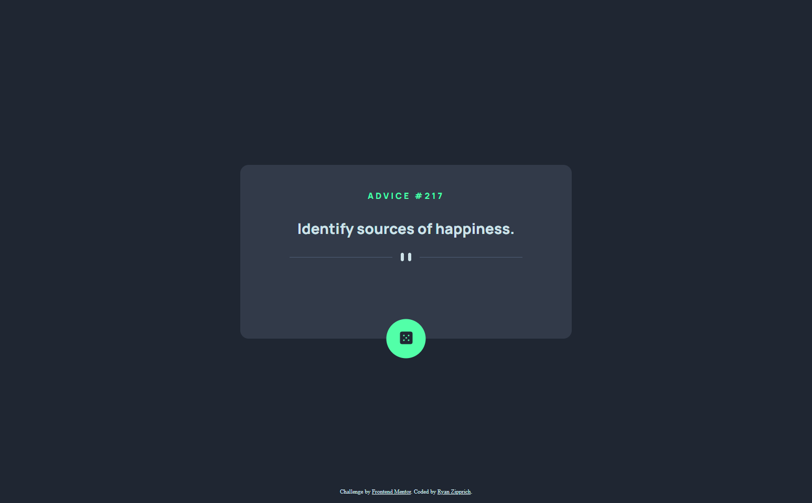

# Frontend Mentor - Advice generator app solution

This is a solution to the [Advice generator app challenge on Frontend Mentor](https://www.frontendmentor.io/challenges/advice-generator-app-QdUG-13db). Frontend Mentor challenges help you improve your coding skills by building realistic projects.

## Table of contents

- [Overview](#overview)
  - [The challenge](#the-challenge)
  - [Screenshot](#screenshot)
  - [Links](#links)
- [My process](#my-process)
  - [Built with](#built-with)
  - [Useful resources](#useful-resources)
- [Author](#author)

## Overview

### The challenge

Users should be able to:

- View the optimal layout for the app depending on their device's screen size
- See hover states for all interactive elements on the page
- Generate a new piece of advice by clicking the dice icon

### Screenshot

Other screenshots can be found in the 'screenshots' folder

### Links

- Solution URL: [https://www.frontendmentor.io/solutions/advice-generator-app--3VxH4mPg6](https://www.frontendmentor.io/solutions/advice-generator-app--3VxH4mPg6)
- Live Site URL: [https://rzipprich.github.io/advice-generator-app/](https://rzipprich.github.io/advice-generator-app/)

## My process

### Built with

- Semantic HTML5 markup
- CSS custom properties
- Flexbox
- Mobile-first workflow

### Useful resources

- [Understanding and Using REST APIs](https://www.smashingmagazine.com/2018/01/understanding-using-rest-api/) - When I initially learned how to use an API this was the resource I used.
- [Page Must Have One Main Landmark](https://dequeuniversity.com/rules/axe/html/4.3/landmark-one-main?application=axeAPI) - Helped me understand why I was getting an accessibility error from Frontend Mentor.
- [Introducing the CSS Cascade](https://developer.mozilla.org/en-US/docs/Web/CSS/Cascade) - Not directly relevant to the project, but I recommended reading through how styles are cascaded if you don't already understand it.

## Author

- Website - [Ryan Zipprich](https://www.ryanzipprich.com)
- Frontend Mentor - [@rzipprich](https://www.frontendmentor.io/profile/rzipprich)
